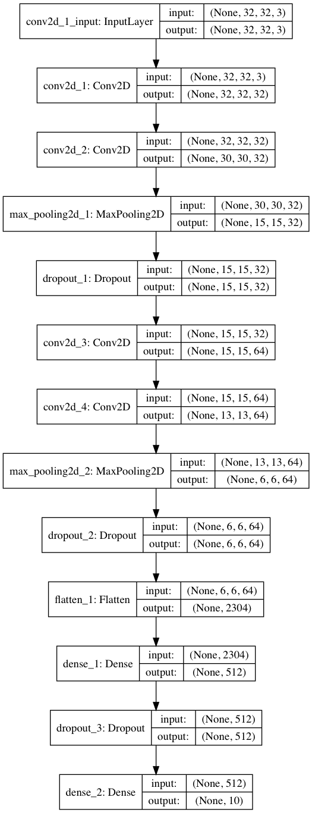

#Implementation of a simple CNN for Image Classifcation in Keras

Trained on CIFAR10 dataset. Gets to about 75% accuracy after 25 epochs.

Current architecture:

Next steps:
Implement VGG architecture to improve performance
Buy a GPU....
